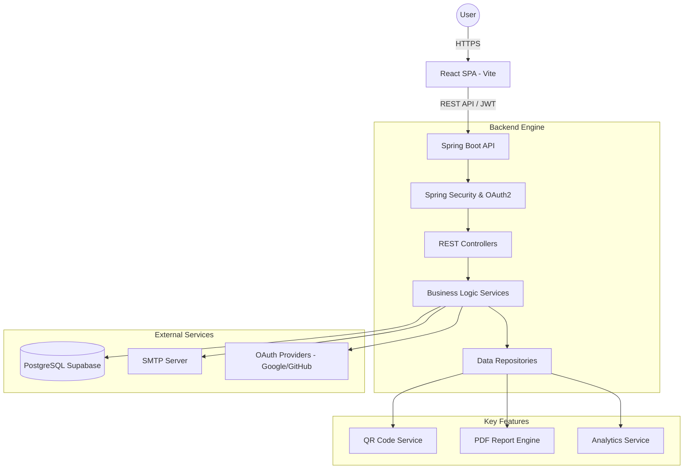

# 🏢 Smart Campus Operations Hub (SLIIT Nexar)

[](https://spring.io/projects/spring-boot)
[](https://reactjs.org/)
[](https://vitejs.dev/)
[](https://tailwindcss.com/)
[](https://opensource.org/licenses/MIT)

> **Elevating Campus Efficiency through Intelligent Automation.**
>
> The Smart Campus Operations Hub is a next-generation management system designed to streamline university life. From biometric and QR-based facility booking to AI-driven career guidance, it provides a centralized platform for students, faculty, and technicians.

---

## 🌟 Key Modules

### 🔐 1. Identity & Access Management (Nexus Auth)
*   **Multi-Factor Security**: JWT-based stateless authentication with OTP (One-Time Password) verification.
*   **Social & Enterprise Login**: Seamless integration with OAuth2 providers (Google, GitHub).
*   **Role-Based Access Control (RBAC)**: Distinct workflows for `USER`, `ADMIN`, and `TECHNICIAN`.
*   **Profile Management**: Comprehensive user profiles with activity tracking and notification preferences.

### 🏢 2. Smart Facility & Resource Orchestration
*   **Real-Time Availability**: Dynamic tracking of study rooms, labs, and equipment.
*   **Intelligent Booking**: Conflict-free scheduling engine with instant email confirmations.
*   **QR Check-in System**: Secure, contactless access validation using unique reservation QR codes.
*   **Resource Inventory**: Centralized management of campus assets and their maintenance states.

### 🔔 3. Omnichannel Notifications
*   **Push & Email Alerts**: Real-time updates for booking status, security alerts, and system announcements.
*   **Granular Preferences**: User-defined notification settings to control what, when, and how you receive alerts.
*   **System Integrity**: Automated cleanup of archival notifications to maintain performance.

### 📊 5. Analytics & Strategic Reporting
*   **Admin Command Center**: Visual dashboards with real-time utilization charts (Recharts).
*   **Automated Reporting**: One-click PDF generation for user management, usage statistics, and maintenance logs (jsPDF).
*   **Data-Driven Insights**: Insightful metrics on peak hours and facility popularity.

---

## 🛠 Tech Stack

### Frontend
- **Framework**: React 18 (Vite-powered)
- **Styling**: Tailwind CSS & Framer Motion (for premium animations)
- **State/Logic**: React Hook Form, Zod (Validation), Axios
- **Visualization**: Recharts, Lucide React (Icons)
- **Utilities**: Date-fns, QRCode.js, jsPDF

### Backend
- **Core**: Java 17, Spring Boot 3.5
- **Security**: Spring Security, OAuth2 Client, JJWT (JWT 0.12.6)
- **persistence**: Spring Data JPA, PostgreSQL (Supabase)
- **Mail**: Spring Boot Starter Mail
- **Productivity**: Lombok

### Infrastructure
- **Database**: PostgreSQL (Hosted on Supabase)
- **CI/CD**: GitHub Actions
- **Hosting**: Vercel (Frontend), [Self-Hosted/AWS/Heroku] (Backend)

---

## 🏗 System Architecture



---

## 🚀 Getting Started

### Prerequisites
- **Java**: JDK 17 or higher
- **Node.js**: v18.x or higher
- **Maven**: 3.8+
- **Database**: PostgreSQL instance (or Supabase URL)

### Backend Setup
1. Clone the repository and navigate to the `backend` folder.
2. Configure `src/main/resources/application.properties`:
   ```properties
   spring.datasource.url=jdbc:postgresql://your-db-url
   spring.datasource.username=your-username
   spring.datasource.password=your-password
   app.jwt.secret=your-super-secret-key-at-least-256-bits
   # OAuth2 Config
   spring.security.oauth2.client.registration.google.client-id=YOUR_CLIENT_ID
   spring.security.oauth2.client.registration.google.client-secret=YOUR_CLIENT_SECRET
   ```
3. Run the application:
   ```bash
   mvn spring-boot:run
   ```

### Frontend Setup
1. Navigate to the `frontend` folder.
2. Create a `.env` file:
   ```env
   VITE_API_BASE_URL=http://localhost:8080/api/v1
   ```
3. Install dependencies and start the dev server:
   ```bash
   npm install
   npm run dev
   ```

---

## 🚢 Deployment

### Frontend (Vercel)
The project is optimized for Vercel deployment. Ensure you set the `VITE_API_BASE_URL` in the Vercel dashboard environment variables.

### Backend
Recommended to host on platforms like Render, AWS, or Heroku. Ensure `application-prod.properties` is configured with managed database strings.

---

## 🤝 Contributing

1. Fork the Project.
2. Create your Feature Branch (`git checkout -b feature/AmazingFeature`).
3. Commit your Changes (`git commit -m 'Add some AmazingFeature'`).
4. Push to the Branch (`git push origin feature/AmazingFeature`).
5. Open a Pull Request.

---

## 📄 License
Distributed under the MIT License. See `LICENSE` for more information.

---
*Created with ❤️ by the Smart Campus Team (Group WE_77)*
